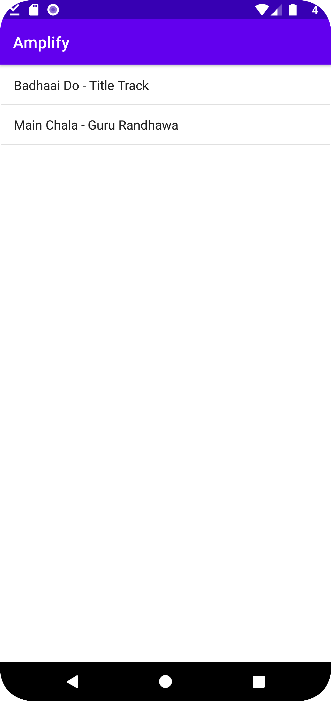
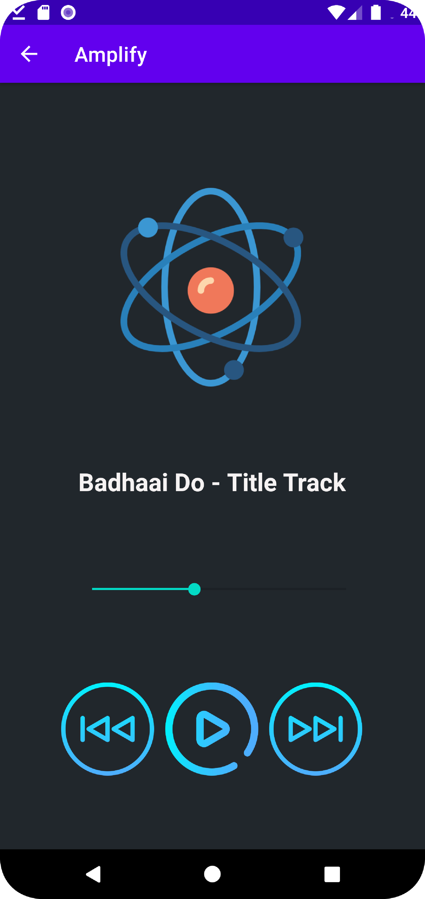

# Music-player-app


  <h1 align="center">Amplify</h3>

  <h3 align="center">
     &raquo; A music player with good UI and functions like play , pause , next and previous . It accesses mp3 files from your local storage when permission is given and plays the files.
    <br />
   


<br>
  
  <div align="center">
  <h1 align="center">Images of app</h1>
  </img>
  </img>
  </div>
  
<br>
<h1 align="center">
    Setting Up the project on your machine  
</h1>
### Install this repo or clone it and unzip it into a single folder.

<br >
You can run it on an AVD(Android Virtual Device) by using android studio . This project is capable of running on android OS only and not iOS. You can test the app by installing the apk(completely safe) . The apk can be downloaded at <a href ="https://drive.google.com/file/d/1fLnou0pqF4ft5iqCT9w1l3tzJwsWecJC/view?usp=sharing">Google drive</a>

#### The splashscreen activity has been disabled . If you wish to activate it , just navigate to "Music-player-app/Amplify/app/src/main/java/com/example/amplify/MainActivity.java" and uncomment the following.
  ```
  try {
         sleep(3000);
      }
      catch (Exception e){
          e.printStackTrace();
      }
  ```
Have fun with music.
  
  
